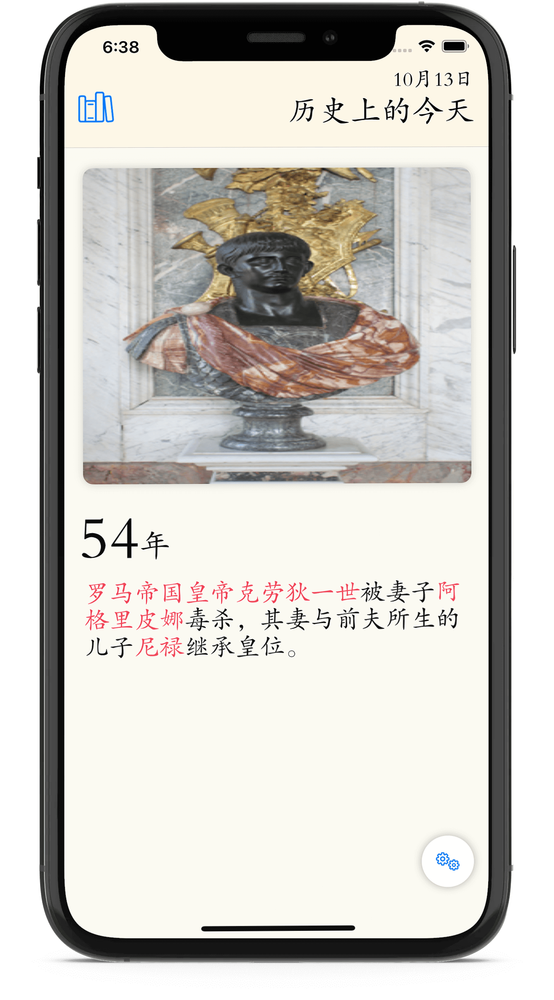
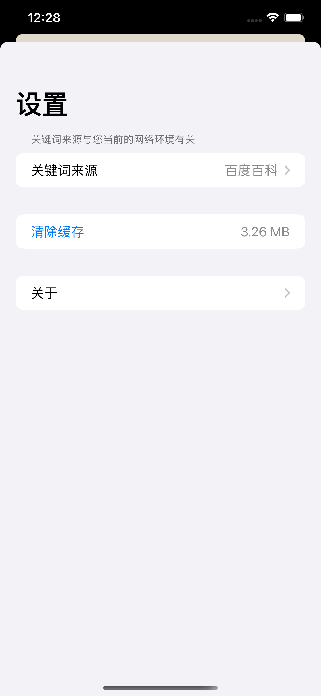
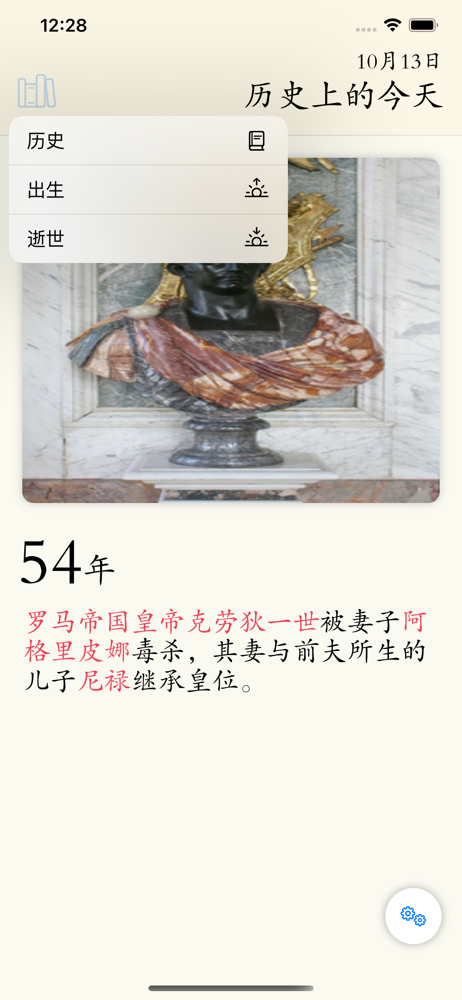
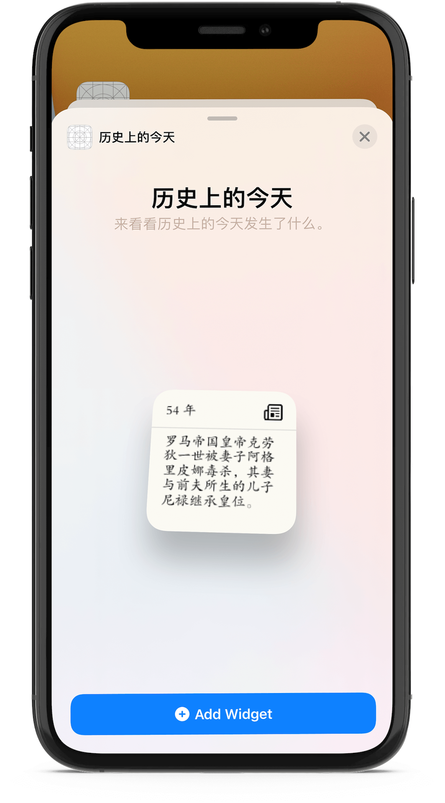

# Important

HistoryToday have been upgraded to the latest SwiftUI features, so you have to use Xcode 12 in order to build & run it. 

# HistoryToday

HistoryToday is an application that uses data crawled from Wikipedia and is built with SwiftUI. The goal is to make a real world application using SwiftUI only and see what SwiftUI can do. It'll be updated with new features as they come to the SwiftUI framework.

   

## Platforms

Currently MovieSwiftUI runs on iPhone, iPad, and macOS (❌ widget for macOS can be built right now, you can delete widget target to run the project). 